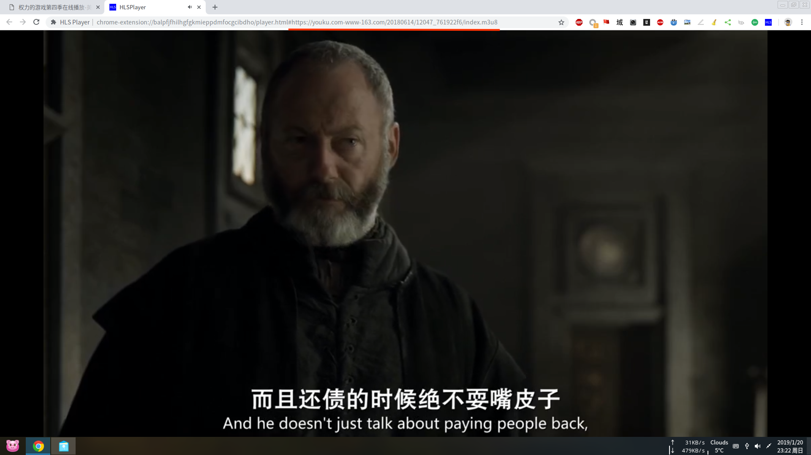

# Chrome Extension: HLSPlayer
Use hls.js to play HLS(m3u8) in Chrome.  
And it will be more easier to get HLS url with [VideoGrab](https://github.com/sonichy/VideoGrab) extension.

  

## Reference:  
[Native HLS Playback](https://chrome.google.com/webstore/detail/native-hls-playback/emnphkkblegpebimobpbekeedfgemhof)  
## Lib:  
